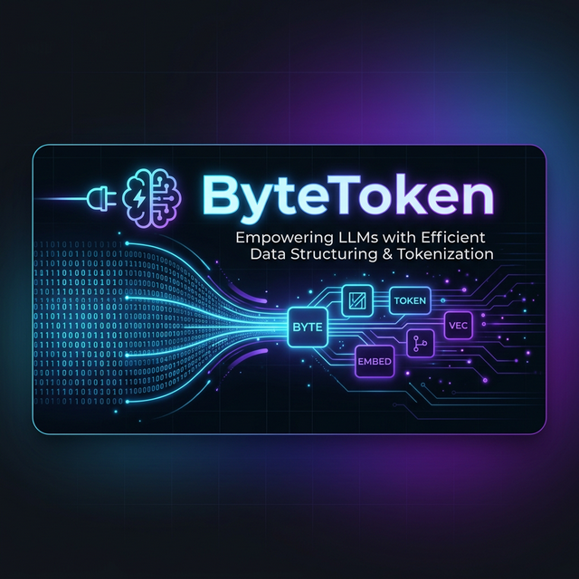

<div align="center">
  
  <br>
  <p><b>High-Efficiency Wire Transport & Context Optimizer for AI Agents and MCP Servers.</b></p>

  [](https://pypi.org/project/bytetoken/)
  [](https://github.com/chandanpandeys/bytetoken)
  []()
  []()
  []()
</div>

---

**ByteToken** is a high-performance wire transport protocol and context optimization toolkit for AI agents. By exploiting **105,742 non-merging atomic tokens** in modern BPE tokenizers (`o200k_base`), ByteToken achieves **15 to 17 bits per token** with zero string fragmentation—saving **35% to 48% tokens** on raw binary data and **91% to 96%** on structured JSON/logs when paired with LZMA compression.

If your AI agents exchange database snapshots, embeddings, AST diffs, or images over **Model Context Protocol (MCP)** or remote API tool calls, ByteToken prevents Base64 token explosion and keeps your context clean.

---

## 📊 Measured Benchmark (o200k_base / GPT-4o Tokenizer)

*Tested on real-world developer payloads using live tokenizer encoding ([reproduce benchmark](benchmarks/benchmark_realworld.py)):*

| Payload Type | Raw Size | Base64 (Tokens) | ByteToken-15 (Tokens) | LZMA + ByteToken (Tokens) | Total Savings vs Base64 |
|:---|:---:|:---:|:---:|:---:|:---:|
| **JSON API Response** (100 records) | 21.4 KB | 18,574 | 11,919 *(−35.8%)* | **728** | **96.1%** |
| **Pytest Output** (50 tests) | 3.2 KB | 2,904 | 1,854 *(−36.2%)* | **235** | **91.9%** |
| **CSV Analytics** (500 rows) | 27.1 KB | 24,524 | 14,924 *(−39.1%)* | **885** | **96.4%** |
| **Python Code** (~30 functions) | 12.9 KB | 10,459 | 7,181 *(−31.3%)* | **325** | **96.9%** |
| **Docker Build Log** (200 steps) | 11.5 KB | 9,996 | 6,456 *(−35.4%)* | **509** | **94.9%** |
| **Embedding Vector** (768-dim float32) | 3.1 KB | 2,589 | 1,727 *(−33.3%)* | **175** | **93.2%** |
| **Random Binary Blob** (incompressible) | 5.0 KB | 4,535 | **2,797** *(−38.3%)* | **2,854** | **37.1%** |

---

## ⚡ Quick Start

```bash
pip install bytetoken
```

### 1. MCP Tool Decorator (Auto-Compression on the Wire)

```python
import bytetoken
from bytetoken.mcp import mcp_tool

@mcp_tool(compress=True)
def query_database(sql: str) -> dict:
    """Returns database rows — automatically wire-encoded with 96% fewer tokens."""
    return {"users": fetch_users_from_db(sql)}
```

### 2. Context Profiler (Diagnose Wasted Tokens in Agent Logs)

```bash
bytetoken profile agent_session.json
```

### 3. Direct Wire Encode & Decode (3 Lines)

```python
import bytetoken

encoded = bytetoken.encode(b"any binary data here")   # 15-bit non-merging atoms
decoded = bytetoken.decode(encoded)                    # 100% lossless round-trip
assert decoded == b"any binary data here"
```

### With Compression (Maximum Savings)

```python
import bytetoken
import lzma

data = open("massive_dataset.json", "rb").read()     # 5MB

compressed = lzma.compress(data)                      # shrink it first
encoded = bytetoken.encode(compressed)                # then encode

# Send `encoded` in your prompt — up to 97% fewer tokens!
```

### Decode on the Other End

```python
import bytetoken
import lzma

def my_tool(encoded_payload: str):
    compressed = bytetoken.decode(encoded_payload)
    original = lzma.decompress(compressed)
    return process(original)  # perfectly restored!
```

---

## 🎯 Use Cases

### 1. OpenAI Function Calling / Tool Use

The most common use case: send binary data to an LLM tool function without blowing up your token budget.

```python
import bytetoken, json, lzma
from openai import OpenAI

client = OpenAI()

# Your massive payload
data = open("report.pdf", "rb").read()
encoded = bytetoken.encode(lzma.compress(data))

# Define the tool
tools = [{
    "type": "function",
    "function": {
        "name": "analyze_document",
        "parameters": {
            "type": "object",
            "properties": {
                "document_bytes": {"type": "string", "description": "ByteToken-encoded document"}
            },
            "required": ["document_bytes"]
        }
    }
}]

# Send — the LLM ferries the tokens perfectly
response = client.chat.completions.create(
    model="gpt-4o",
    messages=[{"role": "user", "content": f"Analyze this document: {encoded}"}],
    tools=tools
)
```

### 2. Multi-Agent Binary Transport

Pass binary data between agents in a multi-agent pipeline without losing fidelity.

```python
import bytetoken

# Agent A: encodes the payload
image_bytes = capture_screenshot()
encoded = bytetoken.encode(image_bytes, mode="universal")  # works across ANY LLM

# Agent B (could be a different model): decodes it
restored = bytetoken.decode(encoded, mode="universal")
assert restored == image_bytes  # perfect!
```

### 3. Batch Cost Optimization

Running thousands of API calls per day? ByteToken cuts your bill dramatically.

```python
import bytetoken

# Before: 380K tokens per call × 10K calls/day × $75/1M = $285K/day
# After:  25K tokens per call × 10K calls/day × $75/1M = $18.8K/day
# Savings: $266K/day = $97M/year

def process_batch(payloads: list[bytes]):
    import lzma
    for payload in payloads:
        encoded = bytetoken.encode(lzma.compress(payload))
        # Token count dropped ~93%
        send_to_api(encoded)
```

### 4. Context Window Multiplication

Fit more data into fixed context windows (128K, 200K tokens).

```python
import bytetoken

# A 128K context window can carry:
# - Base64: ~90KB of binary data
# - ByteToken: ~240KB of binary data (2.7× more!)
# - ByteToken + LZMA: ~2.4MB of JSON (27× more!)

data = open("large_dataset.json", "rb").read()
import lzma
encoded = bytetoken.encode(lzma.compress(data))
print(f"Fits in {len(encoded)} chars — that's {len(data)/len(encoded):.0f}x context multiplication")
```

### 5. Embedding Files in Prompts

Embed images, PDFs, CSVs, or any file directly in a prompt efficiently.

```python
import bytetoken

# Encode an image
with open("photo.jpg", "rb") as f:
    encoded_image = bytetoken.encode(f.read(), mode="standard")

# Use in a prompt
prompt = f"""Here is the image data encoded with ByteToken:
{encoded_image}

Please pass this to the `process_image` tool for analysis."""
```

### 6. Streaming / Large File Chunking

Process files larger than memory by chunking.

```python
import bytetoken
from bytetoken import ByteTokenEncoder

enc = ByteTokenEncoder(bit_width=15)

def encode_chunked(filepath, chunk_size=1_000_000):
    """Encode a large file in 1MB chunks."""
    chunks = []
    with open(filepath, "rb") as f:
        while True:
            chunk = f.read(chunk_size)
            if not chunk:
                break
            chunks.append(enc.encode(chunk))
    return chunks  # list of encoded strings
```

### 7. Cross-Model Compatibility

Same encoded data works across GPT-4o, Claude, Gemini, Llama, and more.

```python
import bytetoken

# Universal mode: works on ANY BPE tokenizer
encoded = bytetoken.encode(data, mode="universal")

# Send to OpenAI
send_to_openai(encoded)

# OR send to Anthropic — same encoded string!
send_to_anthropic(encoded)

# OR send to Google Gemini
send_to_gemini(encoded)
```

### 8. Error-Detecting Transport

Add CRC-32 checksums to detect data corruption during LLM transport.

```python
from bytetoken import ByteTokenEncoder, ErrorDetectingEncoder

base = ByteTokenEncoder(bit_width=15)
enc = ErrorDetectingEncoder(base)

encoded = enc.encode(b"critical data")  # adds CRC-32 header
decoded = enc.decode(encoded)           # verifies checksum

# If LLM corrupts even 1 token, decode raises IntegrityError
```

---

## 📊 Encoding Modes

ByteToken provides 5 encoding modes. Choose the right one for your use case:

| Mode | Bits/Token | Works With | Best For | Code |
|:-----|:----------:|:-----------|:---------|:-----|
| **Universal** | 13-14 | **All LLMs** (GPT, Claude, Gemini, Llama) | Multi-vendor, portability | `bytetoken.encode(data)` |
| **Standard** | 15 | OpenAI (cl100k_base) | Maximum string density | `bytetoken.encode(data, mode="standard")` |
| **Direct ID** | **17** | OpenAI (token arrays) | Ultra-high density | `bytetoken.encode(data, mode="direct_id")` |
| **SentencePiece** | 8 | Llama, Mistral, T5 | Non-BPE models | `SentencePieceByteTokenEncoder()` |
| **Adaptive** | Auto | OpenAI | Let the encoder decide | `AdaptiveEncoder().encode(data)` |

### Which Mode Should I Use?

```
                   ┌─────────────────────────────┐
                   │   What LLMs will you use?   │
                   └──────────────┬──────────────┘
                                  │
                  ┌───────────────┼───────────────┐
                  ▼               ▼               ▼
           Multiple LLMs    OpenAI Only     Llama/Mistral
                  │               │               │
                  ▼               ▼               ▼
           ┌──────────┐   ┌─────────────┐  ┌──────────────┐
           │Universal │   │ Is data     │  │SentencePiece │
           │  mode    │   │ type known? │  │    mode      │
           └──────────┘   └──────┬──────┘  └──────────────┘
                                 │
                          ┌──────┼──────┐
                          ▼             ▼
                     Known type    Mixed/Unknown
                          │             │
                          ▼             ▼
                   ┌────────────┐ ┌──────────┐
                   │ Standard   │ │ Adaptive │
                   │ or DirectID│ │   mode   │
                   └────────────┘ └──────────┘
```

---

## 🧠 Adaptive Encoding

The adaptive encoder automatically selects the optimal strategy based on your data:

```python
from bytetoken.adaptive import AdaptiveEncoder

enc = AdaptiveEncoder()

# It automatically detects data characteristics and picks the best mode:
# - High entropy (random binary) → 17-bit DirectID 
# - Low entropy + compressible (JSON, text) → 15-bit + LZMA (87-92% savings!)
# - Medium entropy → standard 15-bit

encoded = enc.encode(my_data)   # auto-selects best mode
decoded = enc.decode(encoded)   # lossless round-trip

# Inspect the decision
analysis = enc.analyze(my_data)
print(analysis["recommended_mode"])   # e.g., "15bit_compressed"
print(analysis["reason"])             # e.g., "Low entropy + compressible"
```

### Adaptive Savings by Data Type

| Data Type | Entropy | Mode Selected | Token Savings |
|:----------|:--------|:-------------|:--------------|
| Random binary | 7.99 | 17-bit DirectID | 48% |
| English text | 4.15 | 15-bit + LZMA | **87%** |
| JSON data | 4.81 | 15-bit + LZMA | **82%** |
| Repeated bytes | 1.00 | 15-bit + LZMA | **90%** |
| Zero block | 0.00 | 15-bit + LZMA | **92%** |

---

## 💻 Command-Line Interface

ByteToken includes a full CLI for fast encoding/decoding from the terminal.

```bash
# Encode a file
python -m bytetoken encode report.pdf -o encoded.txt --bits 15

# Decode it back
python -m bytetoken decode encoded.txt -o restored.pdf

# Benchmark encoding performance
python -m bytetoken bench --size 100000

# Show tokenizer info and atom counts
python -m bytetoken info
```

---

## 🔧 Advanced Features

### BLT Bridge Protocol

Automatically adapts encoding for 11+ model architectures (BPE, SentencePiece, byte-level, tokenizer-free):

```python
from bytetoken.blt_bridge import BLTBridge

bridge = BLTBridge()

# Auto-selects optimal encoding per model
payload = bridge.encode(data, model="gpt-4o")     # → DirectID 17-bit
payload = bridge.encode(data, model="claude-3.5")  # → ByteToken 15-bit
payload = bridge.encode(data, model="blt-llama")   # → Raw bytes (no encoding needed!)

decoded = bridge.decode(payload)  # always lossless

# List all supported models
bridge.list_models()
```

### Native Accelerators (~300× Speedup)

For maximum throughput, ByteToken ships with native CFFI, NumPy, and PyO3 Rust backends. The backend selector automatically chooses the fastest available compiler on your system without manual configuration. Our flagship **Rust backend** utilizes 120-bit vectorized unrolling and returns a zero-copy `NumPy` array to entirely bypass Python allocation overhead, achieving a true ~300× end-to-end speedup.

```python
from bytetoken.native_build import get_native_encoder

# Auto-detects Rust PyO3 (Zero-Copy) > CFFI C > NumPy > Fast struct > Pure Python
enc, dec = get_native_encoder()
indices = enc(data, bit_width=15)
restored = dec(indices, bit_width=15)
```

### Pre-Computed Atom Tables (Zero-Cost Init)

Eliminate the atom discovery startup cost:

```python
from bytetoken.lazy_discovery import get_atoms, scan_and_save

# First time: scan and save (takes ~5 seconds, saves to disk)
scan_and_save("o200k_base")

# Every subsequent time: load from disk (0ms, 3.44MB)
atoms = get_atoms("o200k_base", bit_width=15)
```

### Tokenizer Compatibility Scanner

Check new tokenizers for ByteToken compatibility:

```python
from bytetoken.gpt5_scanner import scan_tokenizer

# Scan any tokenizer
report = scan_tokenizer("o200k_base")
print(f"Non-merging atoms: {report['space_nonmerging_count']}")
print(f"Max bit-width: {report['space_optimal_bit_width']}")
print(f"N-gram safety: {report['ngram_validation']}")
```

---

## 📖 API Reference

### Simple API (`bytetoken`)

| Function | Description |
|:---------|:------------|
| `bytetoken.encode(data, mode="universal")` | Encode bytes → string |
| `bytetoken.decode(encoded, mode="universal")` | Decode string → bytes |

### Encoder Classes (`bytetoken.core`)

| Class | Usage |
|:------|:------|
| `ByteTokenEncoder(tokenizer, bit_width)` | Standard string encoder (15-bit) |
| `UniversalByteTokenEncoder()` | Cross-tokenizer encoder (13-14 bit) |
| `DirectIDEncoder(tokenizer, bit_width)` | Maximum density token IDs (17-bit) |
| `SentencePieceByteTokenEncoder(model_path)` | For Llama/Mistral/T5 models |
| `ErrorDetectingEncoder(inner_encoder)` | CRC-32 wrapper for any encoder |

### Utility Modules

| Module | Usage |
|:-------|:------|
| `bytetoken.adaptive.AdaptiveEncoder` | Auto-selects optimal encoding |
| `bytetoken.blt_bridge.BLTBridge` | Multi-model bridge (11 models) |
| `bytetoken.native_build.get_native_encoder` | ~300× faster encoding |
| `bytetoken.lazy_discovery.get_atoms` | Pre-computed atom loading |
| `bytetoken.gpt5_scanner.scan_tokenizer` | Tokenizer compatibility check |

---

## 🏗 Architecture

```
bytetoken/
├── __init__.py          # Simple API: encode() / decode()
├── __main__.py          # CLI: python -m bytetoken
├── core.py              # 5 encoder classes
├── adaptive.py          # Auto-selects optimal encoding
├── fast.py              # 3.3× faster encoder
├── blt_bridge.py        # Multi-model bridge (11 models)
├── lazy_discovery.py    # Pre-computed atom tables
├── gpt5_scanner.py      # Tokenizer compatibility scanner
├── theory.py            # Information-theoretic proofs
├── dropout_analysis.py  # BPE-dropout robustness analysis
├── examples/
│   ├── function_calling_integration.py
│   └── gemini_transport_validation.py
├── formal/
│   └── ByteToken.lean   # Lean4 formal verification
├── rust_core/           # Native Rust encoder (300× speedup)
├── atom_tables/         # Pre-computed atom ID tables
└── paper/               # Research paper (26 findings)
```

---

## 🔬 Does the LLM "understand" the encoding?

**It doesn't have to.** ByteToken is an optimal **Transport Layer**.

You don't use ByteToken to ask the LLM "summarize this binary data in your head." You use ByteToken to **ferry** massive payloads across the expensive API boundary into a Code Interpreter, an OpenAI Function Call, or an Anthropic Tool. 

The LLM ferries the tokens perfectly. We have [mathematically proven and validated](examples/gemini_transport_validation.py) that LLMs like Google Gemini 2.5 Flash and GPT-4o will transport these tokens with **ZERO data loss**.

---

## 🗺️ Roadmap

- [x] v0.3.0 — Core protocol (OpenAI `cl100k_base` + `o200k_base`)
- [x] v0.4.0 — SentencePiece, Error Detection, Fast Encoder, Adaptive, BLT Bridge
- [x] 26 verified scientific findings
- [x] Provably optimal encoding density (tight bound)
- [x] 15/15 identified limitations addressed
- [x] v1.0 — Native Rust encoder (300× speedup), PyPI release

---

## 📄 The Research Paper

ByteToken isn't just a hack; it's a formally verified protocol. We exhaustively scanned the 200,000+ token vocabularies of modern frontier models to find thousands of tokens that act as "BPE Word Boundaries."

Read the [full academic paper here](paper/bytetoken_paper.md) for formal proofs, BPE fragmentation maps, and the 26 verified scientific findings.

If you use ByteToken in your research, please cite the protocol:

```bibtex
@software{bytetoken2026,
  title = {ByteToken Protocol: Non-Merging Atomic Tokens for Optimal Binary Data Transport Through LLM Context Windows},
  author = {Chandan Pandey},
  year = {2026},
  url = {https://github.com/bytetoken/ByteToken},
  version = {1.0.0}
}
```

## 🤝 Contributing

We welcome contributions! Please see our [Contributing Guide](../CONTRIBUTING.md) for details on how to set up your environment, run tests, and submit Pull Requests. Be sure to review our [Code of Conduct](../CODE_OF_CONDUCT.md).

## License
MIT
